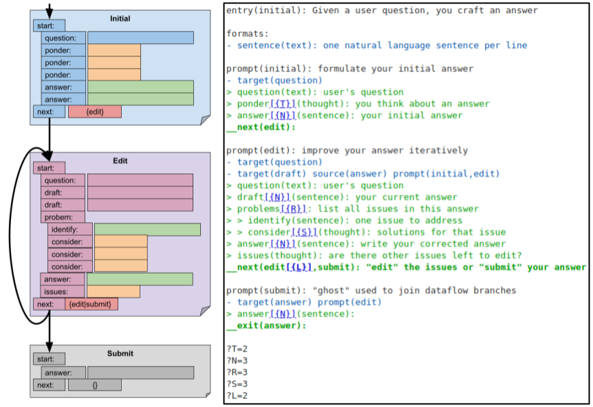
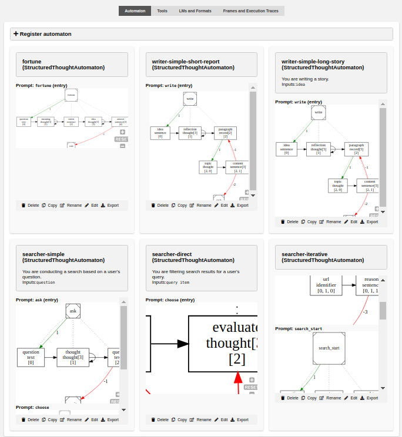

&#9881; Automaton & Cognition
=============================

[](https://github.com/LLNL/AutoCog/actions)
[](https://github.com/LLNL/AutoCog/actions)
[](https://github.com/LLNL/AutoCog/actions)

AutoCog primary goal is to provide the essential components for constructing comprehensive programming languages that can be effectively executed by language models (LMs). Through the utilization of these programming languages, it will becomes feasible to implement symbolic AI algorithms on top of LM.

> [!WARNING]
> As of version v0.3, the priority is to build the actual programming model.
> See [share/sta](https://github.com/LLNL/AutoCog/tree/master/share/sta) for progress, it will hopefully be ready by the end of October.
> The proto-language is deprecated and mostly broken. I might go fix it if anyone ask for it.

[](./share/cgo24/v1)

At present, AutoCog offers Structured Thoughts Automaton (STA) as its sole Programming Model. STA's language is inherently low-level and may present challenges in terms of maintenance. For those interested in delving deeper, we have also made available a [preprint](https://arxiv.org/abs/2306.10196) of our submission to CGO-24. See [share/cgo24/v1](./share/cgo24/v1) for the artifacts of that paper.

As a research software, it is important to note that AutoCog undergoes continuous development, which may result in sudden and non-backward compatible changes. Nonetheless, we strive to maintain an up-to-date [Demo](./demo.ipynb), offering a glimpse into the capabilities of the framework. 

## Current Work

The [share](./share) directory also contains several notepads, particularly the notebooks for [searcher](./share/searcher.ipynb), [reader](./share/reader.ipynb), and [writer](./share/writer.ipynb). The development of these _generic_ STA programs is currently driving the implementation of many features. Particularly, we are building a first set of [unit-tests focused on dataflow](./tests/unittests).

We are developing Finite Thought Automata (FTA) to act as the underlying Machine Model for AutoCog. In a nutshell, FTA enables to express a prompt as a finite automata over the alphabet of the LM. FTA is then used to enforce low-level syntax in the prompt. It ensures that the LM always provides completions that are parseable by the execution model. Initial work on FTA: [source](./autocog/automatons/fta) and [notebook](./share/fta.ipynb) (where we try to force untrained model to ouput numbers as "XX,XXX,XXX.XX" where X is a digit).

## Getting started

### Install

As simple as `pip install -U git+https://github.com/LLNL/AutoCog`.

But, you'll probably want to clone the repository to get the library of programs:
```
git clone https://github.com/LLNL/AutoCog
pip install -U ./AutoCog
```

### Inside a Notebook

Most of the development is done inside Python notebook (jupiterlab).
To get started take a look at the [Demo](./demo.ipynb).
Eventually, several notebooks demonstrating various part of AutoCog will be provided in the [share](./share) folder.

### Command line

`python -m autocog --help`

```
usage: __main__.py [-h] [--version] [--lm LM] [--program PROGRAM] [--tool TOOL] [--prefix PREFIX] [--tee TEE] [--fmt FMT] [--serve] [--host HOST] [--port PORT] [--debug] [--command COMMAND]
                   [--opath OPATH]

options:
  -h, --help         show this help message and exit
  --version          show program's version number and exit
  --lm LM            Inlined JSON or path to a JSON file: `{ "text" : { "cls" : "OpenAI", ... } }` see TODO for details. (default: None)
  --program PROGRAM  Inlined JSON or path to a JSON file: `{ "writer" : { "filepath" : "./library/writer/simple.sta", ... } }` see TODO for details. (default: None)
  --tool TOOL        Inlined JSON or path to a JSON file: `{ "search" : { "cls" : "SerpApi", ... } }` see TODO for details. (default: None)
  --prefix PREFIX    String to identify this instance of AutoCog (used when displaying and saving the prompts) (default: autocog)
  --tee TEE          Filepath or `stdout` or `stderr`. If present, prompts will be append to that file as they are executed. (default: None)
  --fmt FMT          Format string used to save individual prompts to files. If present but empty (or `default`), `{p}/{c}/{t}-{i}.txt` is used. `p` is the prefix. `c` is the sequence id of the call. `t`
                     is the prompt name. `i` is the prompt sequence id. WARNING! This will change as the schema is obsolete! (default: None)
  --serve            Whether to launch the flask server. (default: False)
  --host HOST        Host for flask server. (default: localhost)
  --port PORT        Port for flask server. (default: 5000)
  --debug            Whether to run the flask server in debug mode. (default: False)
  --command COMMAND  Inlined JSON or path to a JSON file: `{ 'callee' : 'writer', ... }` see TODO for details. (default: None)
  --opath OPATH      If present, JSON outputs of the commands will be stored in that file. If missing, they are written to stdout. (default: None)
```

For example, we run commands using:
```
python3 -m autocog --program '{ "writer" : { "filepath":"./library/writer/simple.sta", "content" : "report", "R" : 3, "P" : 2, "N" : 3 } }' \
                   --lm '{ "text"     : { "cls" : "OpenAI", "config" : { "max_tokens" : 20, "temperature" : 0.4 } } }' \
                   --lm '{ "thought"  : { "cls" : "OpenAI", "config" : { "max_tokens" : 15, "temperature" : 1.0 } } }' \
                   --lm '{ "sentence" : { "cls" : "OpenAI", "config" : { "max_tokens" : 30, "temperature" : 0.7 } } }' \
                   --command '{ "tag" : "writer", "idea" : "using finite automaton to constrain the production of auto-regressive language models"  }'
```
This command:
 - build the architecture with one program and 3 LM wrapppers
 - execute the command
 - write `resutls.json`

### Web Application

The goal is to provide a development environment.
Particularly, the ability to inspect and edit/replay `frames`.
These are created for each execution of an `Automaton` (nested when an `Automaton` call another `Automaton`).
Upon ending, the execution trace of the `Automaton` is saved in the corresponding frame.

Eventually, we want to use these traces for two purposes:
 - replay: edit part of the trace then restart the program from that point
 - finetuning: select "succesful" frames to finetune models

Run the command below at the root of the repository to launch a server. It uses [quart](http://pgjones.gitlab.io/quart).
```
python3 -m autocog --serve --host 0.0.0.0 --port 1001 --program tests/library.json --lm tests/openai.json
```
[`tests/library.json`](./tests/library.json) instantiates a few programs from the library.
[`tests/openai.json`](./tests/openai.json) instantiates OpenAI's GPT 3.5 (`text-davinci-003`).

]

### Testing

Minimal testing with [`pipenv run tests/runall.sh`](./tests/runall.sh):
 - [Unit-tests](./tests/unittests)
 - Llama.cpp wrapper (must set $LLAMA_CPP_MODEL_PATH)
 - OpenAI wrapper (must set $OPENAI_API_KEY)
 
Currently only pushes to master trigger GitHub actions.
It tests `pip install` and `STA dataflow` (only set of unit-tests so far).
Looking for way to tests the LLM on GitHub (don't want to expose an API key or move the 4GB minimum of Llama 7B q4).

## Contributing

Contributions are welcome and encouraged!
So far there is only one rule: **linear git history** (no merge commits).
Only the master branch have stable commits, other branches might be rebased without notice.

Version number will increase for each push to master and have a matching tag.

## License

AutoCog is distributed under the terms of the Apache License (Version 2.0) with LLVM exceptions.

All new contributions must be made under Apache-2.0 license (with LLVM exceptions).

SPDX-License-Identifier: Apache-2.0 WITH LLVM-exception

LLNL-CODE-850523
