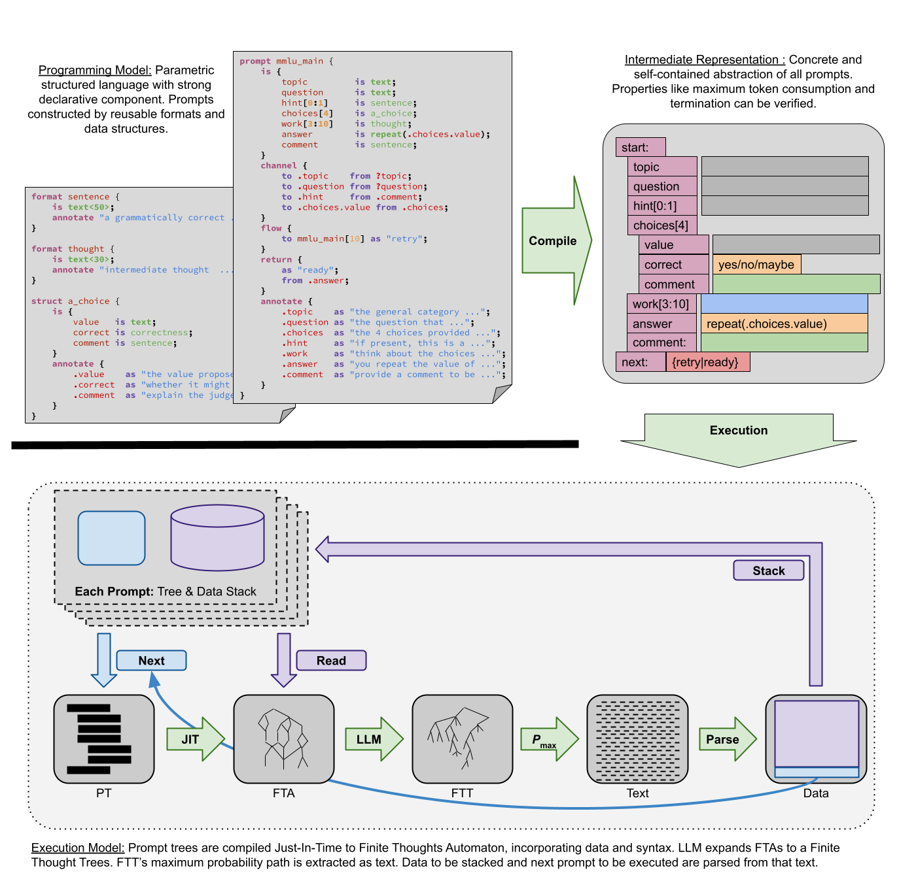

Structured Thought Automaton
============================

Working on language design:
 - [frontend.ipynb](Frontend): actual tests have been moved to [Unit-tests -- Frontend](../../tests/language/frontend.py)
 - [backend.ipynb](Compile): working on backend and Prompt Tree format (aka object or bytes-code style abstraction)
 - [execute.ipynb](Execute): working on the execution model
 - [samples.ipynb](Samples): design samples, should be semantically correct while not always making sense (using extra variables or missing annotations to test features)

 
## TODOs

 - Create a new set of MMLU programs for the library